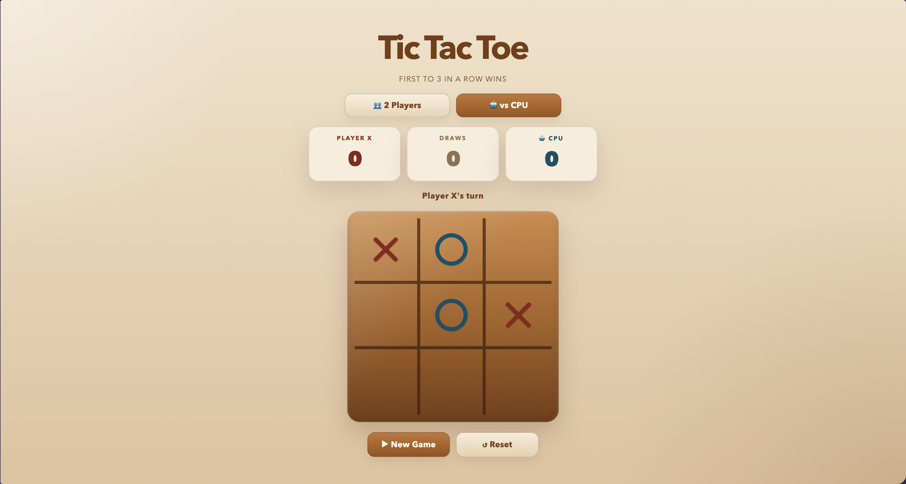

# Tic-Tac-Toe

A browser-based Tic-Tac-Toe game with local multiplayer, a CPU opponent, and a modern wood-themed interface.



## Project Structure

```text
Tic-Tac-Toe/
├── index.html    # Page structure and script loading
├── styles.css    # Layout, theme, and responsive styling
├── js/           # Game scripts
│   ├── config.js # Constants and win patterns
│   ├── state.js  # Shared state and DOM references
│   ├── ui.js     # UI update helpers
│   ├── ai.js     # CPU move selection logic
│   └── game.js   # Main gameplay flow and events
├── README.md     # Project documentation
└── images/       # Screenshots and README assets
```

## Run

Start a local server from the project folder:

```bash
cd /Users/andreas/Desktop/Coding-Projects/Tic-Tac-Toe
python3 -m http.server 8080
```

Then open:

```text
http://localhost:8080/index.html
```

To stop the server, press `Ctrl + C`.

## Requirements

- a modern web browser
- Python 3 for a simple local server

No package installation is required.

## How to Use

1. Open the game in your browser.
2. Choose `2 Players` or `vs CPU`.
3. Click an empty square to place your mark.
4. Try to get 3 in a row to win.
5. Click `New Game` to restart the current round.
6. Click `Reset` to clear scores and start over.

## How It Works

The game runs fully in the browser using HTML, CSS, and JavaScript.

- `state.js` stores the board, scores, current player, and DOM references.
- `ui.js` updates the board, status text, mode state, and scoreboard.
- `game.js` handles turns, win detection, resets, and click events.
- `ai.js` calculates CPU moves using a minimax-style scoring function.
- In `vs CPU` mode, the CPU plays as `O` after the human move.

## Features

- `2 Players` mode
- `vs CPU` mode
- scoreboard for wins and draws
- responsive layout
- animated marks and highlighted winning cells
- classic wood-style design

## Limitations

- the game is limited to Tic-Tac-Toe only
- there is no online multiplayer
- scores reset when the page is refreshed
- the CPU difficulty is fixed

## Privacy

This project does not collect, store, or send personal data.

- no backend
- no database
- no external API
- no account system

Everything runs locally in the browser.

## Roadmap

- add multiple CPU difficulty levels
- add sound effects
- add a move history or round history
- improve accessibility
- add theme switching
